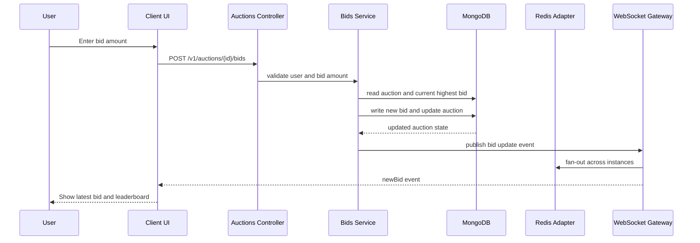
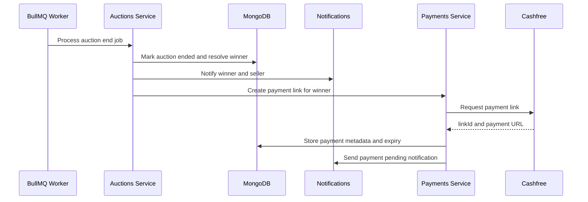

# ARCHITECTURE — Ubuy Backend (one page)

## Overview
Ubuy is a modular NestJS backend powering real-time auctions, bidding, payments and notifications. The design targets a modular-monolith that can be split into microservices when needed.

## Core Components
- API: NestJS controllers and services (versioned under `/v1`).
- Realtime: Socket.IO gateways with a Redis adapter for cross-instance event fan-out.
- Persistence: MongoDB (Mongoose) for domain data (auctions, users, bids, payments).
- Jobs: BullMQ workers for auction lifecycle (end-auction, payment windows, retries).
- Cache/Coordination: Redis for ephemeral state, socket scaling, and simple locks.
- Observability: middleware + metrics service; Swagger and Bull dashboard exposed as admin tools when enabled.

## System Diagram

```mermaid
flowchart TB
	subgraph Client[Client Applications]
		WEB[Web UI]
		MOB[Mobile UI]
	end

	subgraph API[Backend (NestJS)]
		AUTH[Auth Module]
		AUC[Auctions Module]
		BID[Bids Module]
		PAY[Payments Module]
		NOTIF[Notifications Module]
		UPLOAD[Uploads Module]
		WS[Socket Gateway]
		Q[Queue Workers (BullMQ)]
	end

	subgraph Data[Data & Infra]
		MDB[(MongoDB)]
		REDIS[(Redis)]
	end

	subgraph External[External Services]
		CASHFREE[Cashfree]
		CLOUDINARY[Cloudinary]
		EMAIL[Email Provider]
	end

	WEB --> AUTH
	WEB --> AUC
	WEB --> BID
	WEB --> PAY
	WEB --> NOTIF
	WEB --> UPLOAD

	MOB --> AUTH
	MOB --> AUC
	MOB --> BID
	MOB --> PAY
	MOB --> NOTIF

	BID --> WS
	WS --> REDIS

	AUTH --> MDB
	AUC --> MDB
	BID --> MDB
	PAY --> MDB
	NOTIF --> MDB

	Q --> REDIS
	Q --> MDB

	PAY --> CASHFREE
	UPLOAD --> CLOUDINARY
	AUTH --> EMAIL
```

## Key Data Flows

### 1) Bid placement (happy path)


### 2) Auction end and payment window


## Scalability & Reliability
- Stateless API nodes: scale horizontally behind a load balancer.
- Redis adapter for Socket.IO: guarantees event distribution across instances.
- Job-driven lifecycle: BullMQ workers make auction close/retry logic resilient and observable.
- Data consistency: prefer atomic updates and idempotent job handlers; tune `MONGO_MAX_POOL_SIZE` for concurrency.

## Security & Operational Notes
- Protect `JWT_SECRET`, `PAYMENT_WEBHOOK_SECRET`, and other secrets in a secrets manager and rotate regularly.
- Expose admin tools (`/docs`, `/admin/queues`) only when `ENABLE_ADMIN_TOOLS=true` and behind access control in production.
- Add alerts for queue failure rates, high job retry counts, and unusually high bid rates.

## Failure Modes & Mitigations
- Concurrency races on bids: use optimistic writes, re-checks, and reconciliation jobs.
- Stalled or lost jobs: persist metadata, enable retries and dead-letter handling, and monitor stalled jobs.
- Socket disconnects: implement client reconnect and light state-sync endpoints to recover late clients.

## Demo Checklist
- Start local infra (Mongo + Redis), run `npm run demo:start`, and open `http://localhost:8080`.
- Seed auctions (`npm run demo:start` includes seeding) and trigger concurrent bids with `demo-runner` or the load-test scripts.
- Verify `http://localhost:8080/health`, `http://localhost:8080/docs`, and `http://localhost:8080/admin/queues` (with `ENABLE_ADMIN_TOOLS=true`).

