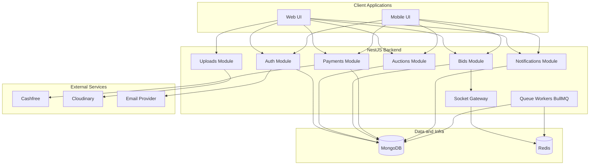
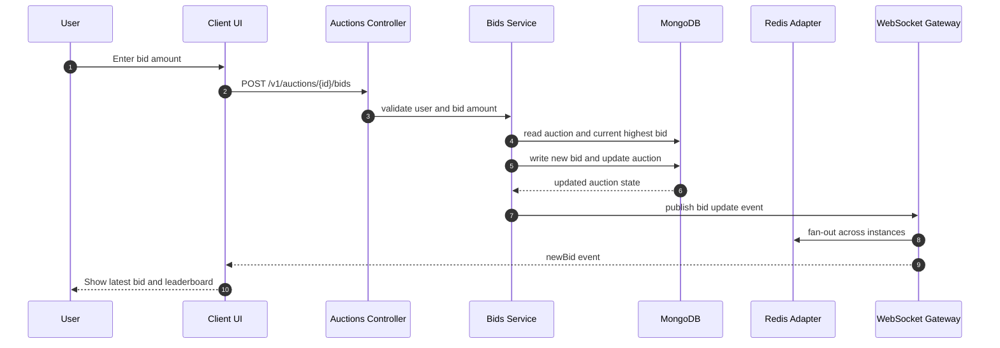
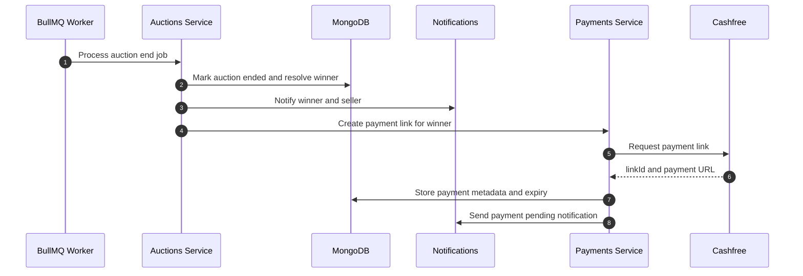
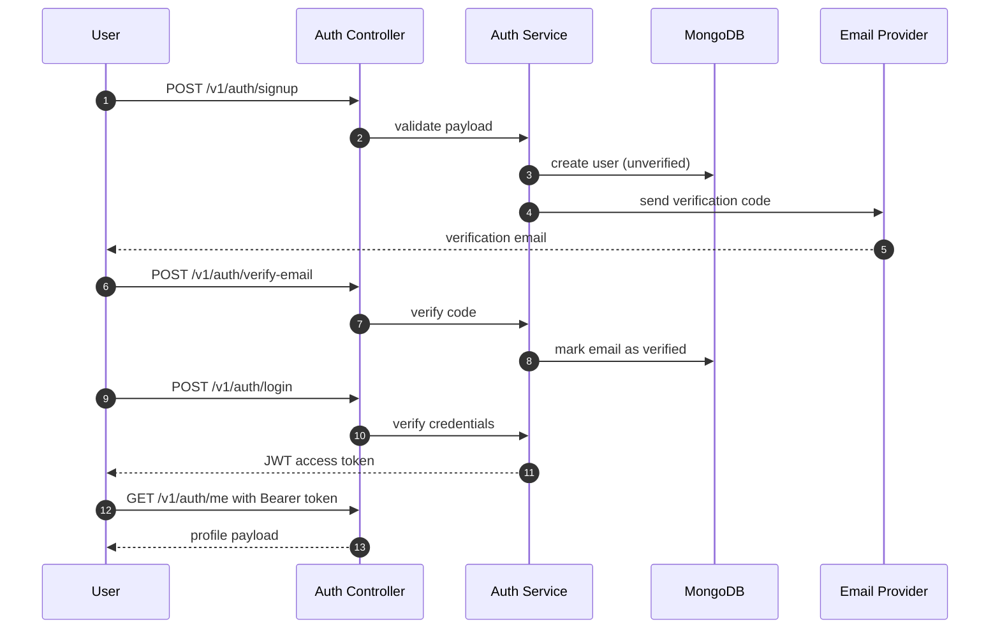

# Ubuy Backend

A scalable, production-ready backend for **Ubuy** - a real-time auction platform.

---

## Table of Contents

- [Overview](#overview)
- [Tech Stack](#tech-stack)
- [Architecture](#architecture)
- [Features](#features)
- [Getting Started](#getting-started)
- [Environment Variables](#environment-variables)
- [Developer Commands](#developer-commands)
- [API Documentation](#api-documentation)
- [Testing](#testing)
- [Coverage Reports](#coverage-reports)
- [Smoke Testing](#smoke-testing)
- [API Quick Check](#api-quick-check)
- [WebSocket Events](#websocket-events)

- [CI Status](#ci-status)

## Overview
Real-time auction system with live bidding, user management, queue-based auction ending, and health monitoring.

---

## Tech Stack
- Node.js, NestJS, TypeScript
- MongoDB
- Socket.IO
- Redis (ioredis + Socket.IO Redis adapter)
- BullMQ (auction lifecycle jobs)

---

## Architecture

### System Diagram



### Data Flow: Real-Time Bid Placement



### Data Flow: Auction End and Payment Window



### Data Flow: Signup to Authenticated Access



---

## Features
- JWT Authentication
- Role-based authorization
- Real-time bidding
- Auction lifecycle management
- Health checkpoint endpoint for backend, MongoDB, Redis, config, and memory

---

## Current Status
- Implemented modules: Auth, Users, Auctions, Bids, Queue, Health
- Root endpoint (`GET /`) returns runtime service status
- Health endpoint (`GET /health`) returns dependency checks and readiness

---

## System Design Explanation

- **Modular Monolith** -> Easily convertible to microservices
- **WebSockets** -> Real-time bidding updates
- **Redis** -> Caching + scaling sockets
- **Kafka (Future)** -> Event-driven architecture

### Scalability Strategy
- Stateless backend
- Horizontal scaling
- Redis adapter for WebSockets

---

## Project Structure

```
src/
|-- common/
|-- modules/
|-- config/
|-- database/
`-- main.ts
```

---

## Getting Started

### Prerequisites

- Node.js 20+
- npm 10+
- MongoDB instance
- Redis instance

### Local Setup

```bash
git clone https://github.com/Anujsinghdevx/Ubuy-backend.git
cd ubuy-backend
npm install
npm run start:dev
```

By default, the application starts on port 6000 unless `PORT` is set.

---

## Environment Variables

For local development and deployment, set at least:

- `MONGO_URI`
- `REDIS_URL` for Render Redis or another hosted Redis instance
- `JWT_SECRET`
- `PAYMENT_WEBHOOK_SECRET` for validating incoming payment webhooks
- `PORT` is provided by Render in production, but can default locally
- `ENABLE_ADMIN_TOOLS=true` only when you want Swagger and the BullMQ dashboard exposed in production
- `FRONTEND_BASE_URL` optional, used to auto-build payment return URL fallback
- `PAYMENT_RETURN_URL` optional, explicit fallback redirect URL after payment
- `PAYMENT_NOTIFY_URL` optional, explicit fallback webhook notify URL sent to payment provider

For secret rotation freshness automation in CI, set repository variables:

- `JWT_SECRET_ROTATED_AT` in `YYYY-MM-DD` format
- `PAYMENT_WEBHOOK_SECRET_ROTATED_AT` in `YYYY-MM-DD` format

---

## Developer Commands

| Command | Purpose |
|---|---|
| `npm run start:dev` | Run API in watch mode |
| `npm run build` | Compile NestJS app |
| `npm run lint` | Run ESLint with autofix |
| `npm run check:local` | Build + prettier check + unit + integration |
| `npm run test:unit` | Run unit tests |
| `npm run test:integration` | Run integration tests |
| `npm run test:e2e` | Run e2e tests |
| `npm run test:smoke` | Run smoke tests |
| `npm run test:all:cov` | Generate combined coverage |
| `npm run infra:local:up` | Start local MongoDB + Redis via Docker |
| `npm run infra:local:down` | Stop local MongoDB + Redis |
| `npm run start:dev:loadtest` | Run backend with `.env.loadtest.local` |
| `npm run load:test` | Run baseline local load test (health + auctions) |
| `npm run load:test:1k` | Run 1000-user ramp local load test |
| `npm run security:audit` | Run npm audit at high severity threshold |

---

## API Documentation

- Swagger UI: `/docs`
- OpenAPI JSON: `/docs-json`
- BullMQ dashboard: `/admin/queues`

Notes:
- Swagger and BullMQ dashboard are available outside production by default.
- In production, expose them only when `ENABLE_ADMIN_TOOLS=true`.

## Testing

For the complete testing strategy, commands, standards, CI recommendations, and troubleshooting, see:

- [TESTING.md](TESTING.md)

## Coverage Reports

Run the suite-specific commands if you want separate reports for each test layer:

- Unit: `npm run test:unit:cov`
- Integration: `npm run test:integration:cov`
- E2E: `npm run test:e2e:cov`
- Smoke: `npm run test:smoke:cov`
- Combined: `npm run test:all:cov`

Each command writes its report to a separate folder:

- [coverage/unit/lcov-report/index.html](coverage/unit/lcov-report/index.html)
- [coverage/integration/lcov-report/index.html](coverage/integration/lcov-report/index.html)
- [coverage/e2e/lcov-report/index.html](coverage/e2e/lcov-report/index.html)
- [coverage/smoke/lcov-report/index.html](coverage/smoke/lcov-report/index.html)
- [coverage/combined/lcov-report/index.html](coverage/combined/lcov-report/index.html)

To view a report locally, open the matching `index.html` file in your browser or in VS Code. In GitHub Actions, download the uploaded artifact with the matching name and open the same file inside the artifact.

## Smoke Testing

- Full smoke suite:

```bash
npm run test:smoke
```

- GitHub Actions options:

```text
.github/workflows/smoke-tests.yml
```

Manual-only workflow (run from Actions tab), supports choosing core or full suite.
Uses external secrets (`MONGO_URI`, `REDIS_URL`, `JWT_SECRET`) from repository secrets.

```text
.github/workflows/smoke-tests-services.yml
```

Runs on push commits and manual dispatch, supports choosing core or full suite.
Uses GitHub Actions service containers (MongoDB + Redis) and does not require external runtime secrets.

---

## API Quick Check
- `GET /` -> service runtime status
- `GET /health` -> backend, MongoDB, Redis, config, memory checks
- `POST /v1/auth/signup`
- `POST /v1/auth/login`
- `POST /v1/auth/verify-email`
- `GET /v1/auth/me` (JWT required)
- `POST /v1/auctions` (JWT required)
- `GET /v1/auctions`
- `GET /v1/auctions/active`
- `GET /v1/auctions/:id`

---

## WebSocket Events
- joinAuction
- leaveAuction
- placeBid
- newBid
- auctionEnded

## Recording a short demo GIF (recommended)

Use the terminal demo runner to capture a short terminal recording suitable for a GIF or screencast. The script queries health and auction lists and simulates activity:

```bash
# Start local infra and app first (see Getting Started)
npm run infra:local:up
npm run start:dev

# In another terminal, run the demo runner
npm run demo:run
```

Recording tools suggestions:
- Linux/macOS: `asciinema` for terminal recordings, or `peek` for animated GIFs.
- Windows: use `Peek` (https://github.com/phw/peek) or a screen-to-gif tool, then crop to the terminal area.

Pro tip: run `npm run demo:run` and record ~10–20s of terminal output — then crop into a short GIF (3–7s) highlighting the health check and auction listing.

## CI Status

Badges (replace `Anujsinghdevx/Ubuy-backend` with your repo if different):

- Build / Workflows (main): 
- k6 Quick Smoke: 
- Mutation Tests: 

Coverage artifacts and k6 summaries are uploaded as workflow artifacts in the respective workflows. Download them from the Actions run for review.

---

## Author
Anuj Singh

---

## Support
Give a star if you like this project!
